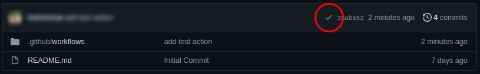
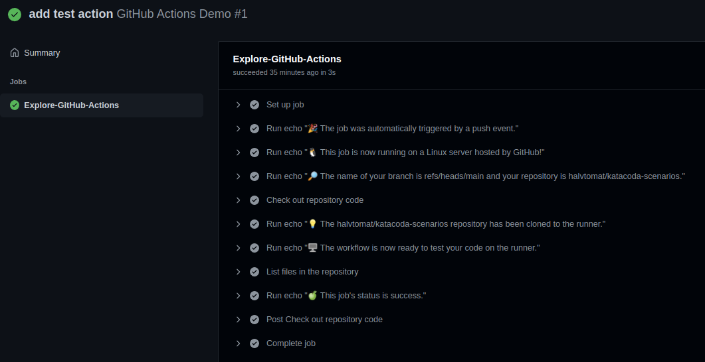

You should now have a `.github/workflows`{{}} directory.

It is time to create your first action.

A new file called `action.yml`{{}} has been created in your `workflows`{{}} directory.

Copy the following YAML content into the `action.yml`{{}} file:

```yaml
name: GitHub Actions Demo
on: [push]
jobs:
  Explore-GitHub-Actions:
    runs-on: ubuntu-latest
    steps:
      - run: echo "🎉 The job was automatically triggered by a ${{ github.event_name }} event."
      - run: echo "🐧 This job is now running on a ${{ runner.os }} server hosted by GitHub!"
      - run: echo "🔎 The name of your branch is ${{ github.ref }} and your repository is ${{ github.repository }}."
      - name: Check out repository code
        uses: actions/checkout@v3
      - run: echo "💡 The ${{ github.repository }} repository has been cloned to the runner."
      - run: echo "🖥️ The workflow is now ready to test your code on the runner."
      - name: List files in the repository
        run: |
          ls ${{ github.workspace }}
      - run: echo "🍏 This job's status is ${{ job.status }}."
```{{copy}}

Now if you push the changes to your GitHub repo, the action is automatically deployed and will run on all future pushes to the repo.

It should now look like this on your future pushes to the repo.


And if you click the ✔ you should see something like this.

